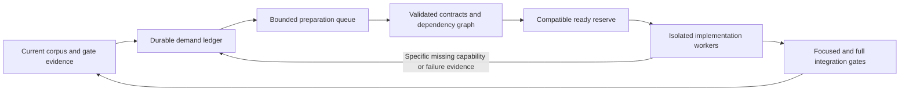

# Ticket supply redesign

Status: proposed longer-term architecture, grounded in the 2026-09-19 live
audit. A subsequent implementation now provides continuous whole-corpus
candidate discovery, bounded staged Map investigation, dependency-first
prioritization and cold job archives through the existing execution contracts.
See [CURRENT](CURRENT.md) and the [RUNBOOK](../../RUNBOOK.md) for active behavior.
The separate preparation work type/ledger and forecasting described below are
still proposals. Existing integration gates and retry authority remain in force.

## Problem and measured baseline

The factory consumes a finite collection of producer-supported tasks. It has
automatic replenishment, but no general process for making unsupported demand
executable. Repeatedly widening one producer or issuing reviewed retry batches
buys time and then exhausts again.

At 07:28 UTC the live controller was running, with zero runnable and zero
deferred tickets, a ready target of eight, and a fill target/cap of twelve.
The watchdog had already reported ten minutes of empty supply. Fresh single-
and multi-miss scans were exhausted; dependency work had durable lifecycle
state; static producers reported duplicates or no safe candidate. Increasing
the queue size would not create candidates.

The full current-parser scan at source
`47681b706341e73afa7a4a38828e9948fa503a8f` measured:

| Review-card disposition | Cards |
|---|---:|
| Outside the general build-plan producer's supported admission rules | 15,427 |
| Supported miss shapes, already owned by a ticket lineage | 959 |
| Ineligible with no reported miss, requiring separate diagnosis | 6 |
| Fresh supported candidates | 0 |
| Total review cards | 16,392 |

These are review-record counts, not distinct semantic tasks or promised card
unlocks. Specialized producers and dependency descendants require their own
lineage reconciliation. An unsupported record may also have earlier attempts.
The scan includes the current carddb review population, not a newly chosen
product-eligibility policy. Funny, digital and otherwise excluded cards must
be filtered against the accepted product manifest before becoming work.

Examples of large currently unsupported families include `static_unmapped`
(1,673 cards), replacement-would (448), targeted modal modes (215), and saga
chapters (185). Family names are discovery indexes, not proof that their cards
share one implementation. The largest bucket, `verb_unmapped:?`, is especially
unsuitable for a single broad implementation ticket.

Evidence: [supply audit](measurements/supply-audit-2026-09-19.json).
Reproduce with `python3 scripts/factory-ng-supply-audit.py`. This reads source,
tickets and jobs, updates only a disposable audit cache, and prints JSON. It
rejects a source change during measurement and isolates individual parser
exceptions so later cards remain visible.

## Replacement architecture

Separate durable demand, preparation and execution. A TicketSpec remains a
small, immutable execution contract; it is no longer the only representation
of unfinished work.

1. Discovery measures all eligible unfinished demand, including categories no
   implementation producer currently supports. It also consumes integration
   results, valid capability requests, and unresolved gate failures. Discovery
   creates demand records; it cannot grant attempts or publish runnable tickets.
2. Preparation turns one bounded question into evidence and a proposed
   contract. Workers can investigate an unsupported parser seam, establish an
   Engine interface, split mixed semantics, or diagnose a failed contract.
   Preparation finishes with an artifact and a disposition, not a code landing.
3. A deterministic compiler validates the evidence, selects a registered scope
   and gate template, and emits Map/Engine TicketSpecs with explicit dependency
   edges. Only dependency-ready, currently compatible contracts enter dispatch.
4. Execution and integration retain their existing authority and gates. A
   completed integration causes affected demand to be remeasured, not merely
   marked done because an attempt succeeded.

Existing proven producers become contract compilers behind this interface.
Their finite cohorts remain finite. Unknown demand is visible preparation work
instead of disappearing behind `exhausted_supported_plan`.

## Durable records and ownership

Use a separate SQLite supply ledger with transactions and unique constraints;
keep existing TicketSpecs and receipts immutable. The controller owns lease and
admission transitions. Discovery/preparation submit artifacts to an inbox; they
never edit live job state. Candidate selection and lease acquisition must be
atomic, including across controller restart.

| Record | Identity and required contents |
|---|---|
| Demand | Stable corpus identity, face/ability locator, semantic obligation, product-manifest identity, first/last measurement, current blockers and owner lineage |
| Measurement | Source revision, parser/corpus/input digests, pinned members and Oracle hashes, exact observations, coverage/completeness and errors |
| Preparation | Demand IDs, one question, evidence budget, allowed read scope, profile requirements, lease, attempt budget, immutable result |
| Contract | Scope/gate template version, behavior and boundary evidence, profile compatibility, dependency IDs and provenance |
| Attempt | Contract/demand IDs, profile, failure class, receipt digest, consumed budget and explicit successor reason |

Demand identity does not include source revision or attempt number. Text hashes
are evidence, not the sole identity: differently named cards with identical
text may share work, and one card can have several distinct obligations.
Grouping retains every member identity. Contract and measurement versions do
include input fingerprints. A new measurement never erases an old attempt.

Demand states are `unmeasured`, `needs_preparation`, `preparing`,
`contract_ready`, `blocked_on_dependency`, `in_execution`, `satisfied`,
`exhausted`, and `excluded`. Each blocked/exhausted/excluded record must have a
reason, the relevant evidence and a precise condition for reconsideration.
Execution-job state remains separate; one attempt failing is not equivalent to
its underlying demand disappearing.

## Preparation contract

Initial scope: one pinned card or one proven homogeneous ability shape, one
question, and one bounded model attempt plus the existing permitted protocol
correction. No recursive model-created tickets, broad corpus sweeps, source
patches, commit/push/deploy authority, or arbitrary test commands.

Allowed outputs:

- `contract_candidate`: one behavior contract with positive and adjacent-negative
  examples, exact source interfaces, scope and a registered gate-template ID.
- `dependency_candidate`: an exact missing capability with consumer demand,
  input/output semantics and discriminating execution examples.
- `split_required`: disjoint member partitions with evidence explaining why
  the original group was mixed; uncovered members remain explicit demand.
- `satisfied`: a claim requiring deterministic current-source confirmation.
- `blocked`: a specific unavailable interface, unsupported contract template,
  missing evidence, or exhausted preparation attempt.

The harness checks source/Oracle binding, product scope, symbol existence,
member coverage, scope/template allowlists, dependency cycles, duplicate
ownership, evidence budgets and profile compatibility. It computes executable
commands from templates; model-supplied shell strings are never executed.
Semantic claims still need discriminating behavior gates, not just schema
validation. New categories without an adequate gate template remain visibly
blocked on compiler support; preparation alone cannot safely make every demand
runnable. Unsupported Ops/compiler changes need their own scoped workflow,
not an Engine ticket with secretly expanded permissions.

A preparation result is successful only when the harness accepts its artifact.
Track downstream compilation and integration yield separately. An unchanged
failed result is not eligible for another preparation ticket because the queue
is empty. Reconsideration requires relevant new evidence or a separately
authorized retry, with the predecessor receipt and budget preserved.

## Dependency handling

Represent the actual sequence, for example Engine foundation → registry bridge
→ Map consumer → whole-card verification. Independent foundations may run in
parallel; descendants wait for their required evidence/integration state.
Deduplicate a shared capability by normalized interface and semantic contract,
not merely its generated name. Count downstream impact as a union of pinned
members so one card is not counted once per dependency.

Reject cycles and dangling dependencies. A failed foundation creates a visible
disposition for its consumers; it cannot silently strand Map work forever.
Bound decomposition depth and child count. If a proposal exceeds either budget,
retain it as split-required demand for an explicit architecture decision.

## Supply policy and scheduling

Keep a small execution reserve and a substantially larger measured/prepared
backlog. Run discovery/preparation independently of execution queue fullness;
the expensive discovery scan must not sit on dispatch's critical path.
Reconcile immediately after a receipt, integration, worker-availability change,
or relevant input change, with a periodic sweep as a recovery mechanism.

Size the reserve from observed consumption and replenishment latency, retaining
the current two-ready-per-worker rule as a floor. Proposed initial policy:

- Low watermark: enough compatible implementation work for 30 minutes or two
  tickets per available worker, whichever is larger.
- High watermark: 60 minutes of compatible work, bounded by an explicit queue
  cap. If the cap cannot satisfy the computed target, report capacity-limited
  supply instead of silently claiming the target was met.
- Preparation backlog: at least two hours of estimated implementation demand,
  conservatively discounted by observed preparation-to-contract conversion.
- While usable demand lacks contracts, reserve one qualified available model
  lease for preparation. Spare compatible leases may prepare when execution
  work is absent. Existing quota, enable and resource controls still apply.
- Prioritize dependency unlocks and oldest feasible demand, then measured
  benefit/cost, with age-based fairness between families and bounded recovery.

Measure compatible *distinct* tickets. A flexible ticket cannot count once for
every worker it could run on. Use worker-slot/ticket matching over the reserve
horizon, honoring one lease per physical worker and alternate-profile limits.
Show current and scheduled-after-quota-reset capacity separately. Do not inflate
the current target with unavailable workers or hide an unavailable-only backlog
inside the ready count.

Use observed completion/claim rates and p95 preparation/compilation latency;
bootstrap conservatively from configured worker concurrency until enough data
exists. Distinguish model time from verification/integration time. Hard caps on
preparation attempts, resource use and pending integration prevent the system
from creating an unlimited speculative backlog.

## Exhaustion is a first-class result

Each scan reports its input fingerprint, cursor/coverage, candidates, dispositions,
and errors. `scan_pending`, `producer_error`, `source_unavailable`,
`no_compatible_profile`, `blocked_on_dependency`, `compiler_extension_required`
and `exhausted_for_inputs` are different states.

An exhausted compiler sleeps until relevant inputs change; it does not cause
all discovery to stop. An unrelated commit does not revive failed work. A
parser crash quarantines that measurement with evidence while independent
cards continue. Never label an incomplete or failed scan as exhausted.

The operational promise is: **while measured, authorized, feasible work remains,
available qualified workers receive execution or preparation work without
manual ticket batches.** A finite corpus cannot support an honest unconditional
promise of infinite tickets. When all remaining work is blocked, exhausted,
excluded or complete, publish the exact reasons and required next action;
never manufacture busywork or reset retry budgets.

## Observability and acceptance

The dashboard should show distinct counts for measured demand, preparation-ready,
preparing, contract-ready, compatible execution-ready, dependency-blocked and
exhausted demand. Add per-profile compatible runway, oldest ready age,
preparation conversion rate, discovered/compiled/claimed rates, and idle minutes
classified by supply, profile, quota, infrastructure or integration backpressure.
Alert before estimated runway falls below replenishment latency. A ten-minute
empty-queue alert remains the final backstop, not the primary supply control.

Acceptance scenarios must include:

1. Drain every fixed producer while unsupported in-scope demand remains: a
   qualified worker receives bounded preparation and an accepted artifact
   produces a validated child contract through the ordinary compiler.
2. Keep implementation supply healthy while preparation continues ahead of it;
   an unrelated slow scan or parser exception cannot stall dispatch.
3. Restart between candidate selection, lease and publication: no duplicate
   attempt, orphan lease or duplicate TicketSpec is created.
4. Change source or Oracle text during preparation: reject stale publication,
   remeasure, and preserve prior identity/attempt history.
5. Exhaust a semantic retry or create a dependency cycle: no fresh-ID loophole,
   repeated preparation loop, or silent blocked descendant.
6. Hold a paid profile or switch an alternate route: reserve accounting respects
   physical leases and distinct compatible tickets.
7. Exhaust all authorized feasible work: honest terminal/blocked demand report,
   no repeated automatic reissues.
8. Canary observation includes an actual frontier drain and at least 24 hours
   of supply/idle metrics; normal gates and enabled-worker policy stay enforced.

## Delivery sequence

1. **Implemented here:** full-frontier read-only audit with current parser
   evidence, source-race rejection, family/combination visibility, error
   isolation and preservation of the existing fresh-admission/lineage rules.
   Six focused regressions pass. It does not publish tickets.
2. Build the supply ledger and event reconciliation in shadow mode. Import
   existing lineages and show coverage/dispositions without scheduling them.
   Require idempotent replay and exact agreement with current ticket ownership.
3. Add the artifact-only preparation runner and validate a small representative
   cohort: a narrow static family, targeted modal behavior, and a replacement
   foundation. Select exact members from current product-eligible measurements;
   do not declare whole family buckets equivalent. Qualify profiles explicitly.
4. Connect accepted preparation artifacts to registered Map/Engine compilers;
   demonstrate the preparation → dependency → consumer → full gate path.
5. Enable reserve forecasting, independent preparation admission and event-driven
   refresh. Run the drain/restart/race/compatibility scenarios and canary.
6. Retire dated one-off producer configuration as each underlying demand source
   is covered; retain all historical receipts and bounded retry rules.

Rollback disables new discovery/preparation admission and preserves the ledger
and artifacts for inspection; existing immutable Map/Engine contracts continue
through their ordinary lifecycle. No automatic rollback should delete demand,
reset job state, replay attempts, or weaken integration gates.
